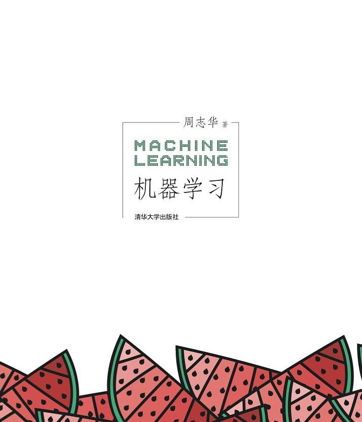
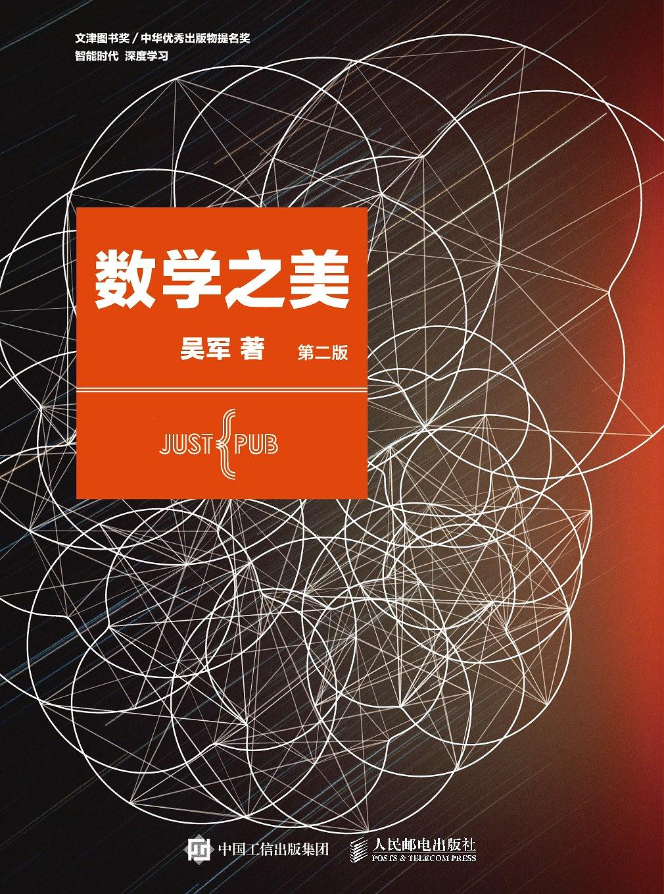

# technical-books

> 读书并不在多，最重要的是选得精，读得彻底。

分享常用的技术书籍，内容主要涉及自然语言处理，机器学习，深度学习，算法，编程及数学等，并将持续更新。

Welcome to watch, star or fork.

## [自然语言处理（Natural Language Processing）](https://github.com/lemonhu/technical-books/tree/master/natural_language_processing)

    

Mining Text Data

## [机器学习（Machine Learning）](https://github.com/lemonhu/technical-books/tree/master/machine_learning)

    
    

　　机器学习　　　　　　　统计学习方法

## [深度学习（Deep Learning）](https://github.com/lemonhu/technical-books/tree/master/deep_learning)

    

深度学习

## [算法（Algorithm）](https://github.com/lemonhu/technical-books/tree/master/algorithm)

    

算法图解

## [数学（Mathematics）](https://github.com/lemonhu/technical-books/tree/master/mathematics)

    

数学之美（第二版）
